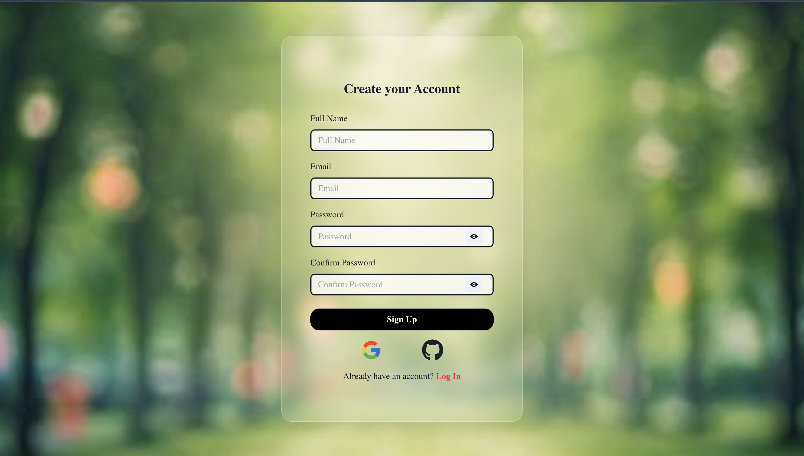
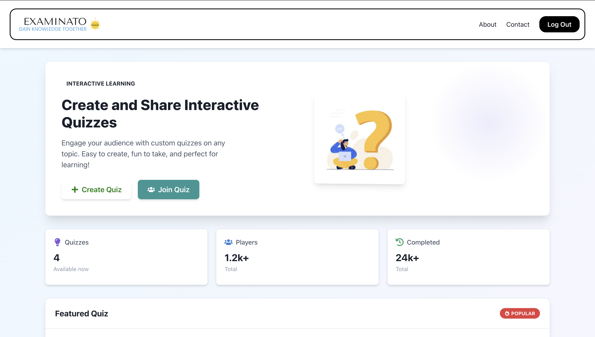
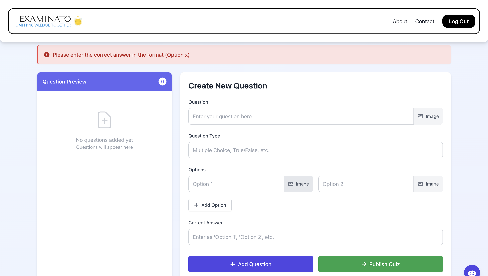
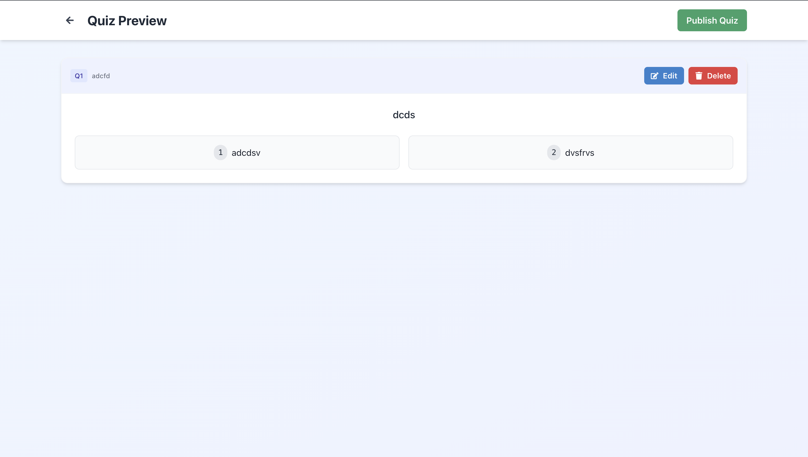
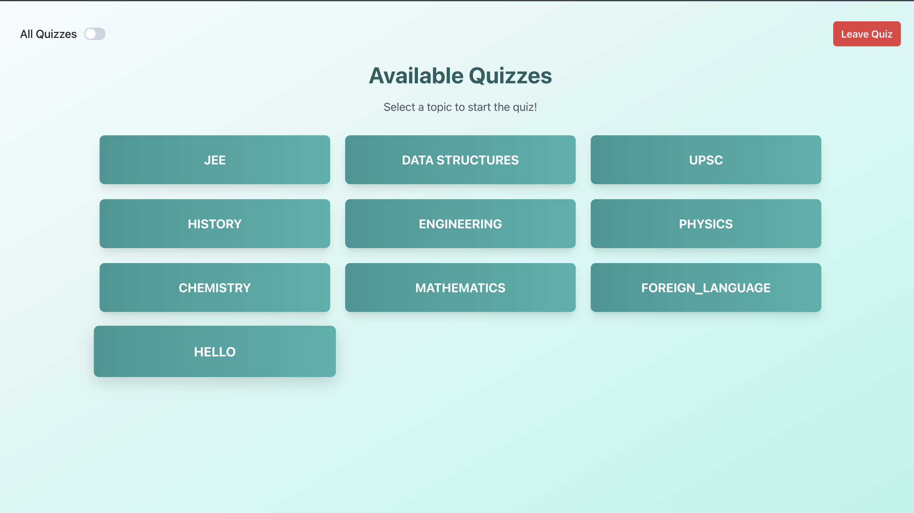
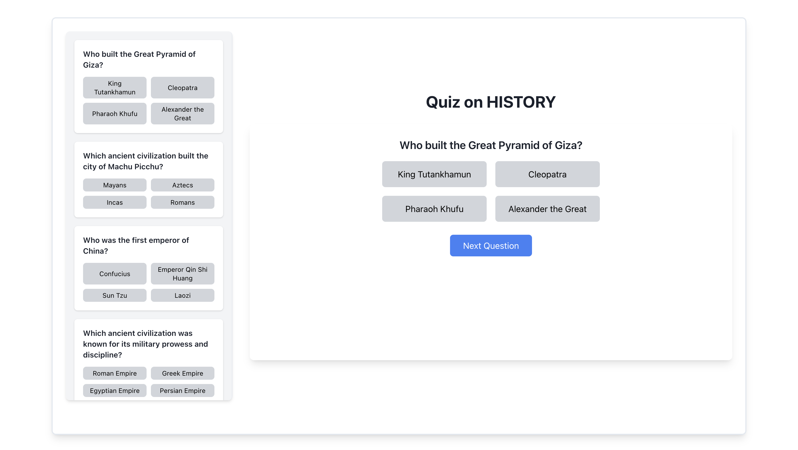
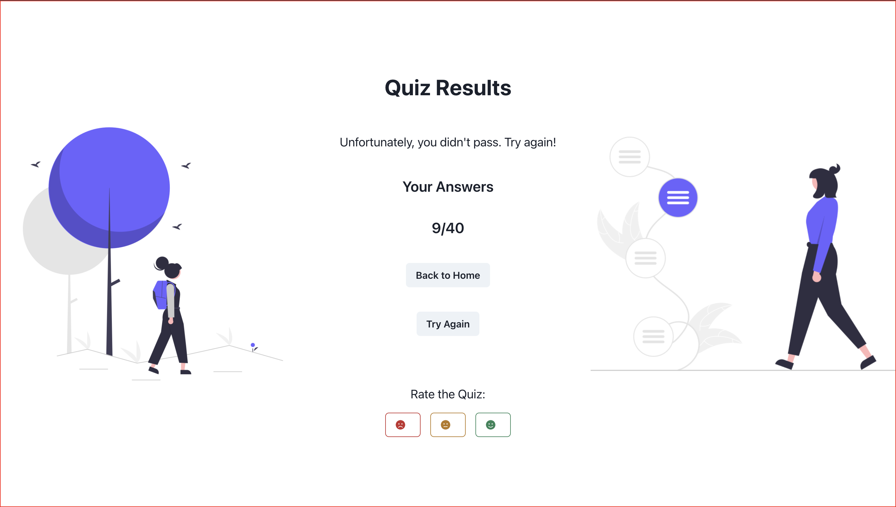

# **Examinato** 🎓📝  
A modern quiz platform that allows users to create and attempt quizzes with interactive features like image uploads, chat assistance, and seamless navigation.  

## 🚀 **Live Demo**  
Try it out here: **[Examinato Live](https://client-ten-navy.vercel.app/)**  

## 🚀 **Tech Stack**  
- **Frontend**: React (with Vite for fast development)  
- **Styling**: Chakra UI (for beautiful, responsive UI)  
- **API Calls**: Axios (for efficient data fetching)  
- **Routing**: React Router (for seamless navigation)  

## ✨ **Features & Functionality**  
- 📚 **Attempt Quizzes**: Fetch quiz questions from an API and take interactive quizzes.  
- ✍️ **Create Quizzes**: Users can add custom questions, options, and set correct answers.  
- 🖼 **Image Uploads**: Enhance quiz questions and options with images.  
- 🤖 **Chatbot Assistance**: Get help while creating or attempting quizzes.  
- 🔄 **Seamless Navigation**: Move between questions smoothly with an intuitive interface.


## 💡 **Inspiration**  
This project is inspired by educational tools designed to improve knowledge retention and engagement through quizzes. The goal is to make learning interactive, enjoyable, and effective.  

---

## 🛠 **Installation Instructions**  
Follow these steps to set up the project on your local machine:

### **1️⃣ Clone the Repository**  
```bash
git clone https://github.com/your-username/examinato.git
cd examinato
```
### **2️⃣ Install Dependencies**
#### Frontend
```bash
cd Client
npm install
npm run dev  # Starts the development server
```
The frontend will be available at http://localhost:5173 (default for Vite).


#### Backend
```bash
cd backend
npm install
npm start  # Starts the backend server

```
The backend will run on http://localhost:5000 (or the configured port).

## 🎮 Usage
- 🔐 Login Required: Users must log in to access quizzes.
- ✅ Take a Quiz: Select a quiz and start answering questions.
- ✏️ Create a Quiz: Add questions, set answers, and upload images.
- 📊 View Results: See quiz results after completion.

## 🤝 Contributing
Contributions are welcome! If you'd like to contribute:

1. Fork the repository.
2. Create a new branch for your feature.
3. Commit your changes.
4. Submit a pull request for review.

## Screenshots
 - The login interface for users.
 - The registration page for new users.
 - The main dashboard after logging in.
 - The interface for creating a new quiz.
 - A preview of the quiz before publishing.
 - The list of available quizzes.
 - The interface for attempting a quiz.
 - The results page after completing a quiz.

## 🌟 Feedback & Support
If you have any feedback, issues, or suggestions, feel free to create an Issue or reach out!

🚀 Happy Coding & Learning! 🎓
