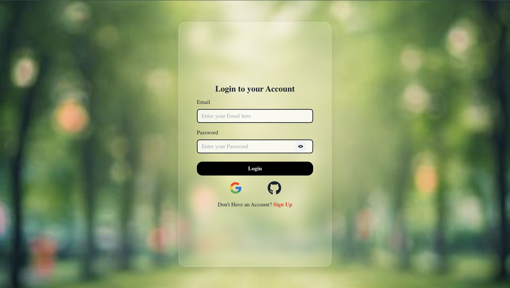

# Project Name

## Tech Stack
- **Frontend**: React
- **Build Tool**: Vite
- **Styling**: Chakra UI
- **API Calls**: Axios
- **Routing**: React Router

## Functionality
- Users can attempt quizzes by fetching questions from an API.
- Users can create quizzes by adding questions, options, and specifying correct answers.
- Features include image uploads for questions and options, a chatbot for assistance, and navigation between questions.

## Inspiration
This project is inspired by educational tools that enhance learning through quizzes, aiming to improve user engagement and knowledge retention.

## Installation Instructions
1. Clone the repository.
2. Navigate to the project directory.
3. For the frontend, run `npm install` to install dependencies.
4. Start the frontend development server with `npm run dev`.
5. For the backend, navigate to the backend directory and run `npm install` to install dependencies.
6. Then, run `npm start` to start the server on your localhost.
5. For the backend, navigate to the backend directory and run `npm start` to start the server on your localhost.

## Usage
- Users must log in to access quizzes.
- Follow the prompts to attempt or create quizzes.

## Contributing
If you'd like to contribute to this project, please fork the repository and submit a pull request.

## Screenshots
 - The login interface for users.
 - The registration page for new users.
 - The main dashboard after logging in.
 - The interface for creating a new quiz.
 - A preview of the quiz before publishing.
 - The list of available quizzes.
 - The interface for attempting a quiz.
 - The results page after completing a quiz.
